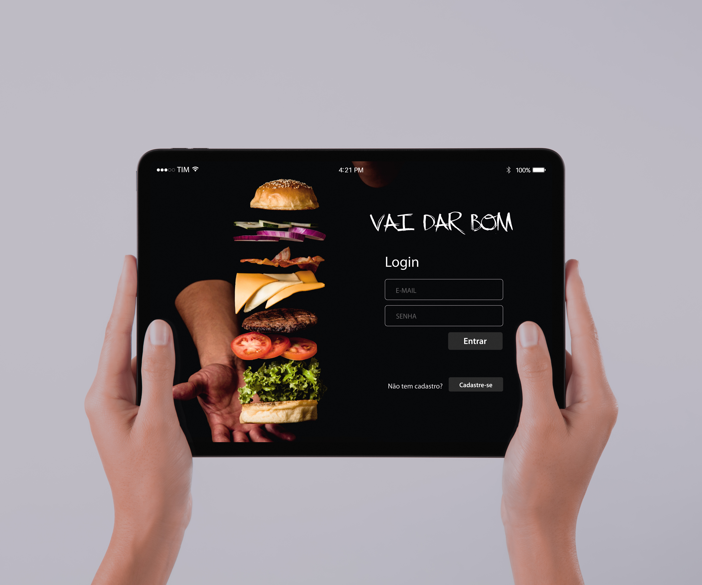

# VAI DAR BOM, BURGUER!

## Índice

* [1. Prefácio](#1-prefácio)
* [2. Resumo do projeto](#2-resumo-do-projeto)
* [3. Considerações gerais](#3-considerações-gerais)
* [4. Definição de Produto](#4-definição-de-produto)
* [5. Testes](#5-testes)
* [6. Considerações Finais](#6-pconsiderações-finais)

***

## 1. Prefácio

VAI DAR BOM é uma hamburgueria em crescimento ampliando seu atendimento e otimizando suas operações
através de uma interface desenvolvida para eles 
Aqui você pode acessar o projeto: [VAI DAR BOM](https://suelenescorcio.github.io/SAP007-social-network/)




## 2. Resumo do projeto

Esse pequeno restaurante de hambúrgueres em crescimento, necessita uma
interface em que se possa realizar pedidos utilizando um _tablet_, e enviá-los
para a cozinha para que sejam preparados de forma ordenada e eficiente.

Este projeto tem duas áreas: interface (cliente) e API (servidor). Nosso
cliente nos pediu para desenvolver uma interface que se integre com a API.

Estas são as informações que temos do cliente:

> Somos **VAI DAR BOM**, um fast food 24hrs.
>
>A nossa proposta de serviço 24 horas foi muito bem recebida e, para continuar a
>crescer, precisamos de um sistema que nos ajude a receber pedidos de nossos
>clientes.
>
>Nós temos 2 menus. Um muito simples para o café da manhã:
>
>| Ítem                      |Preço R$|
>|---------------------------|------|
>| Café americano            |    5 |
>| Café com leite            |    7 |
>| Sanduíche de presunto e queijo|   10 |
>| Suco de fruta natural     |    7 |
>
>E outro menu para o resto do dia:
>
>| Ítem                      |Preço |
>|---------------------------|------|
>|**Hambúrgueres**           |   **R$**   |
>|Hambúrguer simples         |    10|
>|Hambúrguer duplo           |    15|
>|**Acompanhamentos**        |   **R$**   |
>|Batata frita               |     5|
>|Anéis de cebola            |     5|
>|**Bebidas**                |   **R$**   |
>|Água 500ml                 |     5|
>|Água 750ml                 |     7|
>|Bebida gaseificada 500ml   |     7|
>|Bebida gaseificada 750ml   |    10|
>
> **Importante:** Os clientes podem escolher entre hambúrgueres de carne bovina,
> frango ou vegetariano. Além disso, por um adicional de R\$ 1,00 , eles podem
> adicionar queijo **ou** ovo.
>
>Nossos clientes são bastante indecisos, por isso é muito comum que eles mudem o
>seu pedido várias vezes antes de finalizar.

A interface deve mostrar os dois menus (café da manhã e restante do dia), cada
um com todos os seus _produtos_. O usuário deve poder escolher que _produtos_
adicionar e a interface deve mostrar o _resumo do pedido_ com o custo total.

Além disso a cliente nos deu um [link da documentação](https://lab-api-bq.herokuapp.com/api-docs/)
que especifica o comportamento esperado da API que iremos expor por HTTP.
Lá podemos encontrar todos os detalhes dos _endpoints_, como por exemplo
que parâmetros esperam, o que devem responder, etc.

O objetivo principal é aprender a construir uma _interface web_ usando o
_framework_ React. Esses framework front-end ataca
o seguinte problema: **como manter a interface e estado sincronizados**.
Portanto, esta experiência espera familiarizá-la com o conceito de _estado da
tela_, e como cada mudança no estado vai refletir na interface (por exemplo,
toda vez que adicionamos um _produto_ para um _pedido_, a interface deve
atualizar a lista de pedidos e o total).

## 3. Considerações gerais

A lógica do projeto deve ser totalmente implementada em JavaScript (ES6 +), HTML
e CSS e empacotada de forma automatizada.

Este projeto usa-se [React](https://beta.reactjs.org/).

O aplicativo é um _Single Page App_. Os pedidos são enviados por meio
de um _tablet_, porém é um aplicativo Web **mobile-first**.

### 3.1 Boilerplate

Este projeto inclui um _boilerplate_ contendo estrutura de pastas e testes unitários (_tests_): 

```text
.
├── node_modules
├── public
|  ├── favicon.ico 
|  ├── index.html
├── src
|  ├── components 
|  |  |  └── time
|  |  |  |   └── date.jsx
|  |  |  |   └── time.jsx
|  |  |  └── cart.jsx
|  |  |  └── compoments.module.css
|  |  |  └── menuHamburguer.jsx
|  |  |  └── orderCards.jsx
|  |  |  └── orderProduct.jsx
|  |  |  └── productInfos.jsx
|  |  |  └── resultPrice.jsx
|  ├── img 
|  ├── pages 
|  |  |  └── kitchen
|  |  |  |   └── kitchen.jsx
|  |  |  |   └── useKitchen.js
|  |  |  └── login
|  |  |  |   └── login-signup.module.css
|  |  |  |   └── login.jsx
|  |  |  |   └── formLogin.js
|  |  |  └── menu
|  |  |  |   └── menu.jsx
|  |  |  |   └── menu.module.css
|  |  |  |   └── useProducts.js
|  |  |  └── signup
|  |  |  |   └── signup.jsx
|  |  |  |   └── useSignupForm.js
|  ├── routes
|  |  |  └── privateRoute.js
|  |  |  └── routes.js
|  ├── services
   |  |  └── api.js
|  |  |  └── localStorage.js
|  ├── app.jsx
|  ├── index.css
|  ├── index.js
└── test
├── package-lock.json
├── package.json
├── README.md

```

## 4. Definição de Produto

O [_Product Owner_](https://www.youtube.com/watch?v=7lhnYbmovb4) nos apresentou
este _backlog_ que é o resultado do seu trabalho com o cliente até hoje.

***

### 4.1 Histórias de Usuário

#### [História de usuário 1] Garçom/Garçonete deve poder entrar no sistema

Eu, como garçom/garçonete quero entrar no sistema de pedidos.

##### Critérios de aceitação

O que deve acontecer para satisfazer as necessidades do usuário?

* Acessar uma tela de login.
* Inserir email e senha.
* Receber mensagens de erros compreensíveis, conforme o erro e as informações inseridas.
* Entrar no sistema de pedidos caso as credenciais forem corretas.

##### Definição de pronto

O acordado abaixo deve acontecer para dizer que a história está terminada:

* Você deve ter recebido _code review_ de pelo menos uma parceira.
* Fez _testes_ unitários e, além disso, testou seu produto manualmente.
* Você fez _testes_ de usabilidade e incorporou o _feedback_ do usuário.
* Você deu deploy de seu aplicativo e marcou sua versão (tag git).

***

#### [História de usuário 2] Garçom/Garçonete deve ser capaz de anotar o pedido do cliente

Eu como garçom/garçonete quero poder anotar o pedido de um cliente para não
depender da minha memória, saber quanto cobrar e poder enviar os pedidos para a
cozinha para serem preparados em ordem.

##### Critérios de aceitação

O que deve acontecer para satisfazer as necessidades do usuário?

* Anotar o nome do cliente.
* Adicionar produtos aos pedidos.
* Excluir produtos.
* Ver resumo e o total da compra.
* Enviar o pedido para a cozinha (guardar em algum banco de dados).
* Funcionar bem em um _tablet_.

##### Definição de pronto

O acordado abaixo deve acontecer para dizer que a história está terminada:

* Você deve ter recebido _code review_ de pelo menos uma parceira.
* Fez _testes_ unitários e, além disso, testou seu produto manualmente.
* Você fez _testes_ de usabilidade e incorporou o _feedback_ do usuário.
* Você deu deploy de seu aplicativo e marcou sua versão (tag git).

***

#### [História de usuário 3] Chefe de cozinha deve ver os pedidos

Eu como chefe de cozinha quero ver os pedidos dos clientes em ordem, poder
marcar que estão prontos e poder notificar os garçons/garçonetes que o pedido
está pronto para ser entregue ao cliente.

##### Critérios de aceitação

* Ver os pedidos ordenados à medida em que são feitos.
* Marcar os pedidos que foram preparados e estão prontos para serem servidos.
* Ver o tempo que levou para preparar o pedido desde que chegou, até ser marcado
  como concluído.

##### Definição de pronto

* Você deve ter recebido _code review_ de pelo menos uma parceira.
* Fez _testes_ unitários e, além disso, testou seu produto manualmente.
* Você fez _testes_ de usabilidade e incorporou o _feedback_ do usuário.
* Você deu deploy de seu aplicativo e marcou sua versão (tag git).

***

#### [História de usuário 4] Garçom/Garçonete deve ver os pedidos prontos para servir

Eu como garçom/garçonete quero ver os pedidos que estão prontos para entregá-los
rapidamente aos clientes.

##### Critérios de aceitação

* Ver a lista de pedidos prontos para servir.
* Marcar os pedidos que foram entregues.

##### Definição de pronto

* Você deve ter recebido _code review_ de pelo menos uma parceira.
* Fez _testes_ unitários e, além disso, testou seu produto manualmente.
* Você fez _testes_ de usabilidade e incorporou o _feedback_ do usuário.
* Você deu deploy de seu aplicativo e marcou sua versão (tag git).
* Os dados devem ser mantidos intactos, mesmo depois que um pedido for
  finalizado. Tudo isso para poder ter estatísticas no futuro.

***

### 4.2 Fluxograma

Definimos qual seria o fluxo que o usuário seguiria dentro do seu aplicativo 


### 4.3 Protótipo

E a partir do fluxograma, criamos o prótotipo de como seria a interface do usuário (UI) que seguisse este fluxo.


### 4.4 Paleta de Cores

A partir das Histórias de Usuário, Pesquisa de Campo, Definição de Desenho da Interface do Usuário
concluímos que precisaríamos de uma Paleta de Cores que agregasse personalidade ao produto, ajudando
o desempenho e usabilidade do produto.


## 5. Testes

Foram realizados teste unitários, assíncronos e integrados.

* Os testes de unidade cobrem no mínimo 70% de _statements_, _functions_,
  _lines_ e _branches_.

  A aplicação segue 80% ou mais das pontuações de Performance, Progressive
Web App, Accessibility e Best Practices do [Lighthouse](https://developers.google.com/web/tools/lighthouse/)

## 6. Considerações Finais** 

- [x] O planejamento deste projeto se encontra no [Trello](https://trello.com/b/gXKsOtaO/burguer-queen)
- [x] O repositório deste projeto se encontra no [GitHub](https://github.com/CassiaCosta/SAP007-burger-queen-api-client)
- [x] O deploy deste projeto está hospedado no [GitPages](https://suelenescorcio.github.io/SAP007-social-network/)
- [x] Este projeto foi desenvolvido por [Cássia Costa](https://github.com/CassiaCosta) e [Karol Sontak](https://github.com/karolsontak)
